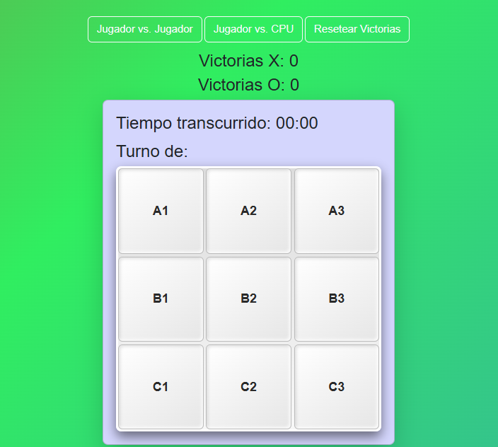

# 🧠 **TicTacToe-IA**

A simple yet powerful project to play Tic-Tac-Toe, either against another person or an AI opponent. The AI is powered by the **Minimax Algorithm**, ensuring challenging gameplay for all skill levels. 

---

## 🖼️ **Preview**



---

## 🎮 **Features**
- 🏆 **Statistics Panel**: Tracks wins and losses for both players.
- ⏱️ **Timer**: Measures the time spent in each match.
- 🎮 **Game Modes**: Switch between two-player mode or AI mode.
- 🔄 **Reset Functionality**: Reset victories and start fresh.
- ✨ **User-Friendly Design**: Sleek and responsive interface for an enjoyable experience.

---

## 🔧 **Technologies Used**
This project is built with:
- **HTML**: For structuring the webpage.
- **CSS**: For a clean, modern design.
- **JavaScript**: To handle game logic and AI functionality.

---

## 🧠 **How the AI Works**
The AI leverages the **Minimax Algorithm** to determine its moves:
- Simulates every possible future move.
- Maximizes its chances of winning while minimizing yours.
- Ensures optimal decisions for challenging gameplay.

---

## 🚀 **Getting Started**
1. Clone this repository:
   ```bash
   git clone https://github.com/yourusername/tictactoe-IA.git
